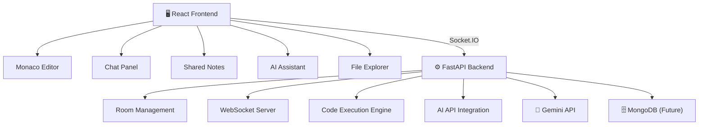

# 🚀 CollabCode

> Real-time collaborative coding platform with live code synchronization, shared notes, chat, AI assistance, active editor tracking, and code execution.

---

# 📌 Overview

CollabCode is a collaborative coding environment that allows multiple users to join a shared room and work together in real time.

Users can:

- Write code collaboratively
- Chat with team members
- Maintain shared notes
- Execute code directly from the editor
- Track active editors and cursor positions
- Receive join/leave notifications
- Ask an integrated AI assistant coding-related questions
- Work with multiple files inside the same workspace

The project aims to provide a lightweight collaborative IDE experience inspired by modern development tools such as VS Code Live Share, Replit, and Cursor.

---

# ✨ Features

## 👥 Real-Time Collaboration

- Live code synchronization using WebSockets
- Instant updates across connected users
- Room-based collaboration

## 💬 Team Chat

- Real-time messaging
- Typing indicators
- Join/Leave notifications
- User avatars

## 📝 Shared Notes

- Collaborative note-taking
- Instant synchronization across all users

## 🤖 AI Coding Assistant

- Powered by Google Gemini
- Context-aware coding help
- Bug explanations
- Algorithm guidance
- Code generation assistance

## 📂 Multi-File Workspace

- Create multiple files
- Switch between files
- Shared file updates

## ⚡ Code Execution

- Execute Python code directly
- View output in integrated console

## 👀 Active Editor Tracking

- See who is currently editing
- Live cursor position synchronization

## 🔒 Room-Based Access

- Create rooms
- Join existing rooms
- Password-protected room workflow (local implementation)
                 

---

# 🏗️ Architecture

---

# 🛠️ Tech Stack

## Frontend

- React
- TypeScript
- Vite
- Monaco Editor
- Framer Motion
- Socket.IO Client
- Lucide React

## Backend

- Python
- FastAPI
- Socket.IO
- Uvicorn

## AI

- Google Gemini API

## Communication

- WebSockets
- Socket.IO

## Version Control

- Git
- GitHub

---

# 📷 Screenshots

## Home Page

---

## Chat + Active Editors

---

## AI Assistant

---

## Collaborative Editor

---

# 🎥 Demo Live

Demo Link: (SOON....)

---

# 📂 Project Structure

---

# ⚙️ Installation Guide

## Prerequisites

Install:

- Python 3.10+
- Node.js 18+
- npm
- Git

Verify installation:

bash python --version node --version npm --version git --version 

---

# Step 1: Clone Repository

bash git clone https://github.com/YOUR_USERNAME/CollabCode.git  cd CollabCode 

---

# Step 2: Backend Setup

Move into backend:

bash cd backend 

Create virtual environment:

### Windows

bash python -m venv venv  venv\Scripts\activate 

### Mac/Linux

bash python3 -m venv venv  source venv/bin/activate 

Install dependencies:

bash pip install -r requirements.txt 

---

# Step 3: Configure Gemini API

Create:

text backend/.env 

Add:

env GEMINI_API_KEY=YOUR_GEMINI_API_KEY 

Get API key from:

https://aistudio.google.com

---

# Step 4: Start Backend

bash python server.py 

Backend should start at:

text http://localhost:8000 

---

# Step 5: Frontend Setup

Open a second terminal:

bash cd frontend 

Install dependencies:

bash npm install 

Start frontend:

bash npm run dev 

Frontend should start at:

text http://localhost:5173 

---

# Step 6: Open Application

Visit:

text http://localhost:5173 

Create a room and start collaborating.

---

# 🔄 Typical Workflow

1. Create a room
2. Share room information
3. Collaborators join
4. Edit code together
5. Use shared notes
6. Chat with team members
7. Run code
8. Ask AI assistant for help

---

# 🔐 Security Notes

Current version uses local room validation.

Planned improvements:

- Backend room authentication
- MongoDB persistence
- Secure room management
- JWT authentication

---

# 🚀 Future Enhancements

## Persistence

- MongoDB integration
- Persistent rooms
- Persistent files
- Persistent chat history

## Deployment

- Azure Deployment
- Docker Support
- CI/CD Pipeline

## Collaboration

- Advanced cursor tracking
- User-specific cursor colors
- File permissions

## AI

- Explain code
- Detect bugs
- Optimize code
- Generate unit tests

## Language Support

- Python
- C++
- Java
- JavaScript
- Go

---

# 🤝 Contributing

Contributions, suggestions, and feedback are welcome.

Fork the repository and submit a pull request.

---

# 📄 License

This project is developed for educational and collaborative learning purposes.

---

# 👨‍💻 Author

Aditya

IIT Guwahati

Built with ❤️ using React, FastAPI, Socket.IO, Monaco Editor, and Gemin
